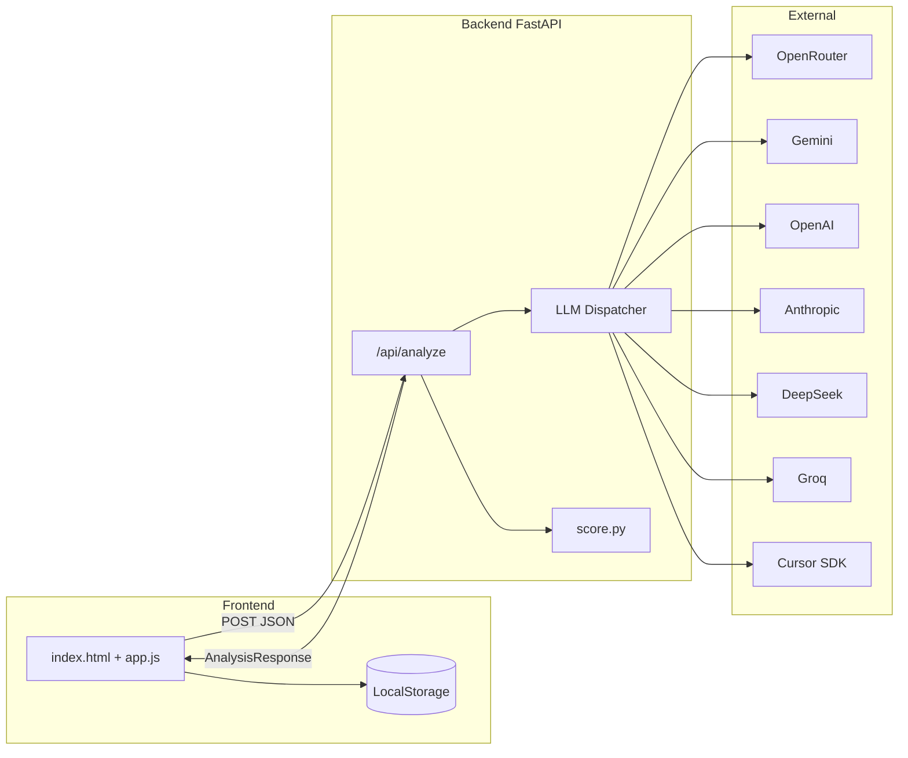
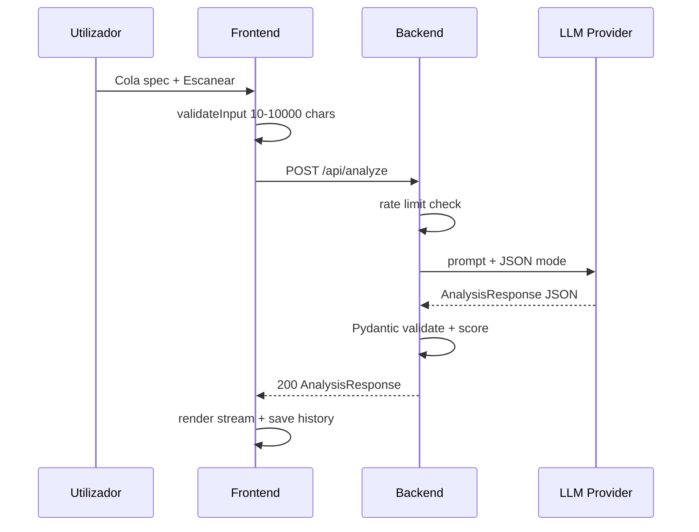

# Xray

> Raio-X de especificações — inspeciona prompts, requisitos e briefings antes de enviá-los a uma IA ou time de desenvolvimento.

[](LICENSE)
[]()

O Xray analisa a qualidade estrutural de uma especificação em seis dimensões ponderadas, atribui um score de 0 a 100 e devolve um diagnóstico acionável: lacunas, ambiguidades, suposições ocultas, sugestões e uma proposta de revisão (before/after). O sistema **não inventa requisitos** — revela o que falta clarificar.

---

## Sumário

- [Hero](#hero)
- [Quick Start](#quick-start)
- [Visão Sistêmica](#visão-sistêmica)
- [Arquitetura Deep Dive](#arquitetura-deep-dive)
- [Fluxos de Dados & Estados](#fluxos-de-dados--estados)
- [Documentação de Interface](#documentação-de-interface)
- [Manutenibilidade](#manutenibilidade)
- [Contribuição & Git Flow](#contribuição--git-flow)
- [Referências & Glossário](#referências--glossário)

---

## Hero

Ver [topo](#xray).

---

## Quick Start

**Pré-requisitos:** Python 3.11+, chave de API de um provedor LLM suportado.

```bash
# 1. Configurar ambiente
cp .env.example .env
# Edite .env com sua chave e provedor

# 2. Backend (terminal 1)
cd backend
python3 -m venv .venv
source .venv/bin/activate
pip install -r requirements.txt
uvicorn app.main:app --reload --port 8000 --host 127.0.0.1

# 3. Frontend (terminal 2)
cd frontend
python3 -m http.server 5500 --bind 127.0.0.1
```

Abra **http://127.0.0.1:5500**, cole uma especificação (mín. 10 caracteres) e clique **Escanear**.

| Serviço | URL |
|---------|-----|
| Frontend | http://127.0.0.1:5500 |
| API | http://127.0.0.1:8000 |
| Swagger | http://127.0.0.1:8000/docs |

**Falha comum:** CORS bloqueado — confirme que `XRAY_CORS_ORIGINS` inclui a origem exata do frontend.

<details>
<summary><strong>Variáveis de ambiente</strong></summary>

| Variável | Obrigatória | Default | Descrição |
|----------|-------------|---------|-----------|
| `XRAY_LLM_PROVIDER` | não | `openrouter` | `openrouter`, `gemini`, `openai`, `anthropic`, `deepseek`, `groq`, `cursor` |
| `LLM_PROVIDER` | não | — | Alias de `XRAY_LLM_PROVIDER` |
| `OPENROUTER_API_KEY` | se openrouter | — | Chave OpenRouter |
| `GEMINI_API_KEY` | se gemini | — | Chave Google Gemini |
| `OPENAI_API_KEY` | se openai | — | Chave OpenAI |
| `ANTHROPIC_API_KEY` | se anthropic | — | Chave Anthropic |
| `DEEPSEEK_API_KEY` | se deepseek | — | Chave DeepSeek |
| `GROQ_API_KEY` | se groq | — | Chave Groq |
| `CURSOR_API_KEY` | se cursor | — | Chave Cursor (Dashboard → Integrations) |
| `XRAY_CURSOR_MODE` | se cursor | `plan` | `plan` (ask-like) ou `agent` |
| `XRAY_CURSOR_CWD` | se cursor | raiz do repo | Workspace do agente local |
| `XRAY_DEFAULT_MODEL` | não | por provedor | Modelo LLM |
| `LLM_MODEL` | não | — | Alias de `XRAY_DEFAULT_MODEL` |
| `XRAY_CORS_ORIGINS` | não | localhost:5500 | Origens CORS (vírgula) |
| `XRAY_RATE_LIMIT` | não | `10` | Req/min por IP |
| `XRAY_LLM_TIMEOUT` | não | `25` | Timeout LLM (segundos) |

**Defaults por provedor** (quando `XRAY_DEFAULT_MODEL` está vazio):

| Provider | Modelo default |
|----------|----------------|
| openrouter | `anthropic/claude-sonnet-4.5` |
| gemini | `gemini-3-flash-preview` |
| openai | `gpt-4o` |
| anthropic | `claude-sonnet-4-20250514` |
| deepseek | `deepseek-chat` |
| groq | `llama-3.3-70b-versatile` |
| cursor | `composer-2.5` |

Troque apenas o `.env` — sem alterar código:

```env
XRAY_LLM_PROVIDER=anthropic
XRAY_DEFAULT_MODEL=claude-sonnet-4
ANTHROPIC_API_KEY=sk-ant-...
```

Ver `.env.example` para template completo.

</details>

---

## Visão Sistêmica

O Xray opera como um pipeline de inspeção: o frontend valida entrada localmente, o backend orquestra a chamada LLM, valida o JSON de resposta e recalcula o score como fonte de verdade.



**Stakeholders:** desenvolvedores e product owners que escrevem specs para LLMs ou times técnicos.

---

## Arquitetura Deep Dive

| Componente | Responsabilidade | Tecnologia |
|------------|------------------|------------|
| `frontend/js/app.js` | Máquina de estados, scan, histórico | Vanilla JS (ES modules) |
| `frontend/js/renderer.js` | Stream de inspeção, telemetria, diff | DOM |
| `backend/app/routes/analyze.py` | Endpoint de análise | FastAPI |
| `backend/app/services/analyzer.py` | Prompt → LLM → validação → retry | asyncio |
| `backend/app/services/llm.py` | Dispatcher via registry | httpx |
| `backend/app/services/providers/` | Adapters por provedor | httpx |
| `backend/app/services/score.py` | Recálculo ponderado do score | Pydantic |
| `backend/app/middleware/rate_limit.py` | Rate limit por IP em `/api/*` | ASGI middleware |

**Decisão:** score recalculado no backend (não confia no total do LLM). **Decisão:** retry único se JSON inválido → 422.

**Dimensões e pesos:**

| Dimensão | Peso |
|----------|------|
| Contexto | 20% |
| Objetivo | 20% |
| Restrições | 15% |
| Especificidade | 15% |
| Clareza | 15% |
| Critérios de Sucesso | 15% |

---

## Fluxos de Dados & Estados



**Estados do frontend:** `Initializing` → `Idle`/`Ready` → `Analyzing` → `Results` | `ErrorState` | `OfflineMode`

---

## Documentação de Interface

### `GET /api/health`

Verifica conectividade com o provedor LLM.

```bash
curl -s http://127.0.0.1:8000/api/health
```

```json
{"status":"ok","provider":"openrouter","model":"anthropic/claude-sonnet-4.5","llm":"connected","openrouter":"connected"}
```

### `POST /api/analyze`

Analisa uma especificação.

```bash
curl -sS -X POST "http://127.0.0.1:8000/api/analyze" \
  -H "Content-Type: application/json" \
  -d '{
    "text": "Crie um sistema de login com email e senha para usuários internos.",
    "type": "requirement"
  }'
```

| Campo | Tipo | Obrigatório | Descrição |
|-------|------|-------------|-----------|
| `text` | string | sim | 10–10.000 caracteres |
| `type` | enum | sim | `prompt` \| `requirement` \| `briefing` |
| `model` | string | não | Override do modelo LLM |

| Status | Significado |
|--------|-------------|
| 200 | Análise concluída |
| 400 | Validação de entrada |
| 422 | JSON do LLM inválido após retry |
| 429 | Rate limit excedido |
| 502 | LLM indisponível |
| 504 | Timeout LLM |

Documentação interativa: http://127.0.0.1:8000/docs

---

## Manutenibilidade

**Estrutura do repositório:**

```
Xray-Spec/
├── backend/app/          # FastAPI application
│   ├── routes/           # /api/health, /api/analyze
│   ├── schemas/          # Pydantic request/response
│   ├── services/         # LLM registry, analyzer, score, prompts
│   │   └── providers/    # openrouter, gemini, openai, anthropic, deepseek, groq, cursor
│   └── middleware/       # Rate limiting (required)
├── frontend/
│   ├── index.html
│   ├── css/styles.css
│   └── js/               # ES modules, no bundler
├── .env.example
└── LICENSE
```

**Frontend timeout:** `frontend/js/config.js` define `REQUEST_TIMEOUT_MS = 90000` — modelos free podem demorar >60s.

**Histórico:** até 50 análises em `localStorage` (`xray_history`). Texto da spec **não** persiste no backend.

### Provedores LLM

Arquitetura baseada em **adapters** — cada provedor expõe `chat_completion()` e `probe()`. O dispatcher (`llm.py`) seleciona o módulo via `XRAY_LLM_PROVIDER`.

Erros de API são expostos ao utilizador de forma amigável (sem stack trace):

```
OpenAI (gpt-4o) failed:
Invalid API key.
```

### Provedor Cursor

Usa o [Cursor SDK](https://cursor.com/docs/sdk/python) (`cursor-sdk`) com `AsyncAgent.prompt()` — **não** é chat/completions HTTP.

```env
XRAY_LLM_PROVIDER=cursor
XRAY_DEFAULT_MODEL=composer-2.5
CURSOR_API_KEY=cursor_...
XRAY_CURSOR_MODE=plan
```

| Aspecto | Detalhe |
|---------|---------|
| **Modo `plan`** | Equivalente ao Ask do IDE — explora/responde sem implementar alterações (default) |
| **Modo `agent`** | Pode usar ferramentas e editar ficheiros no `XRAY_CURSOR_CWD` |
| **Requisitos** | Cursor Pro, API key, `cursor-sdk` instalado, bridge local do SDK |
| **Timeout** | Análises podem demorar mais — ajuste `XRAY_LLM_TIMEOUT` (ex.: 120) |

O SDK não expõe um modo `ask` literal; `plan` + instrução JSON-only no prompt é o mapeamento usado.

---

## Contribuição & Git Flow

1. Fork → branch feature → PR
2. Não commitar `.env`, `__pycache__/`, `.venv/`
3. Testar localmente: backend :8000 + frontend :5500

Convenção de commits: imperativo, foco no *why* (`add`, `fix`, `refactor`).

---

## Referências & Glossário

| Termo | Definição |
|-------|-----------|
| **Spec Health** | Score 0–100 da qualidade estrutural |
| **Gap** | Informação ausente que impede execução confiável |
| **Ambiguity** | Termo com múltiplas interpretações |
| **Assumption** | Premissa não declarada com risco |
| **[A DEFINIR]** | Marcador no after — decisão pendente do autor |

**Evoluções futuras (não implementadas):** benchmarking entre providers, comparação de custo/latência, leaderboard de modelos.

**Licença:** [MIT](LICENSE)
